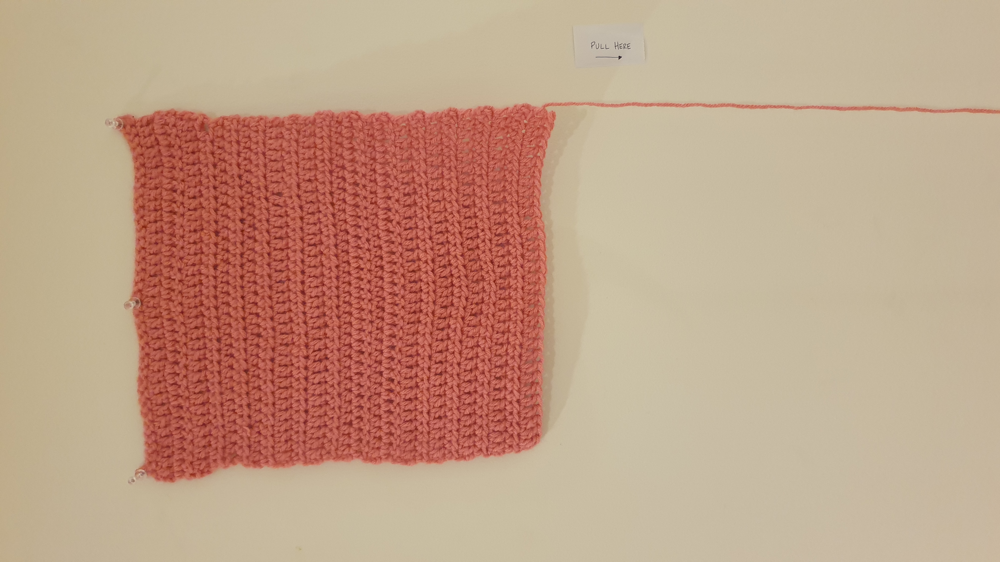
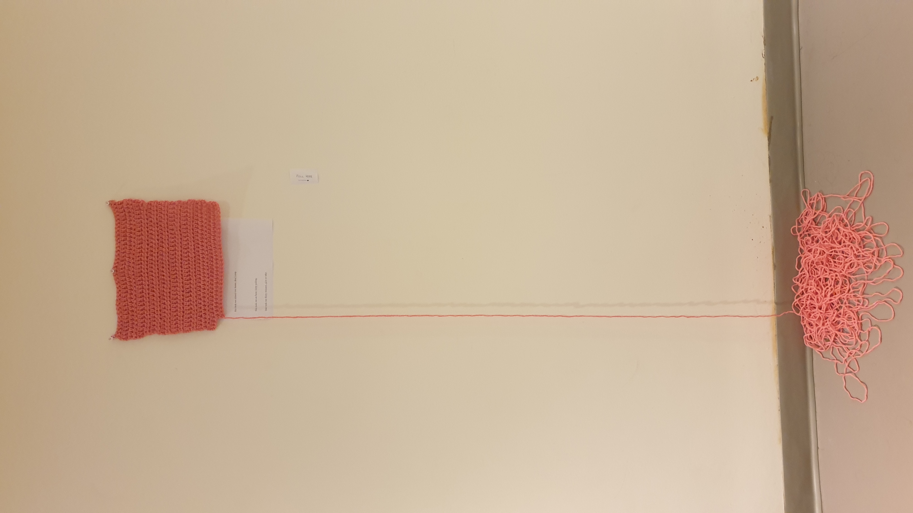

# Prototype 3: seven hours.

<table border="0" width="100%"><tr>
<td>  </td>
<td>  </td>
<td>  </td>
</tr></table>

<table border="0" width="100%"><tr>
<td>  </td>
<td>  </td>
<td>  </td>
<td>  </td>
</tr></table>

<table border="0" width="100%"><tr>
<td>  </td>
<td>  </td>
<td>  </td>
<td>  </td>
</tr></table>

<table border="0" width="100%"><tr>
<td>  </td>
<td>  </td>
</tr></table>

## Description
Two simple works of art, inspired by old computer generated graphics. Makes use of for() loops to achieve the "vintage" look of classic computer art. I used [this](https://www.youtube.com/watch?v=LaarVR1AOvs) tutorial for inspiration.

## Screenshot of Output:

### Art with rotate() and trigonometric functions within for loops

### Art with random() function within for() loops

  
Warning, fast flashing images!

  

## Challenges/Discoveries
* Using the rotate() function within the for() loop proved more challenging than I thought, but I was able to manipulate it satisfactorily after reading up on its Reference page.
* The random() function generates decimal numbers as well, which aren't accepted in RGB values, so I truncated it by adding (int) before each random() function.
* Playing around with the sin() function and observing the effects of multiplicative and additive factors was actually quite interesting.
